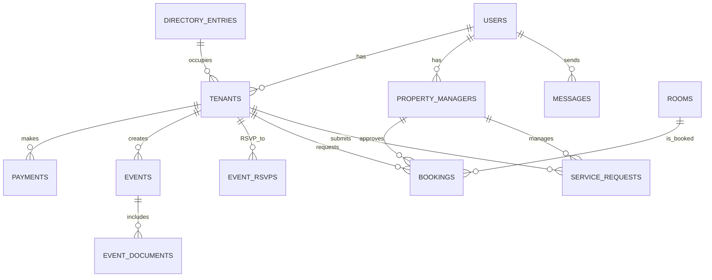

# Database Schema Design

This document details the proposed database schema for the Corporate Office 101 mobile application, designed to support all outlined features including user management, payments, events, room bookings, service requests, message board, and an interactive directory.

## 1. Entity-Relationship Diagram (Conceptual)

## 2. Table Definitions

### `Users` Table
Stores core user authentication and role information.

| Column Name          | Data Type       | Constraints             | Description                                   |
| :------------------- | :-------------- | :---------------------- | :-------------------------------------------- |
| `id`                 | UUID/INT        | PRIMARY KEY, NOT NULL   | Unique identifier for the user                |
| `email`              | VARCHAR(255)    | NOT NULL, UNIQUE        | User's email address, used for login          |
| `password_hash`      | VARCHAR(255)    | NOT NULL                | Hashed password for security                  |
| `role`               | VARCHAR(50)     | NOT NULL                | User role: 'tenant' or 'property_manager'     |
| `created_at`         | TIMESTAMP       | DEFAULT CURRENT_TIMESTAMP | Timestamp of user creation                    |
| `updated_at`         | TIMESTAMP       | DEFAULT CURRENT_TIMESTAMP | Last update timestamp                         |

### `Tenants` Table
Stores specific information for tenant users.

| Column Name                  | Data Type       | Constraints                     | Description                                   |
| :--------------------------- | :-------------- | :------------------------------ | :-------------------------------------------- |
| `id`                         | UUID/INT        | PRIMARY KEY, NOT NULL           | Unique identifier for the tenant              |
| `user_id`                    | UUID/INT        | NOT NULL, UNIQUE, FK to `Users` | Foreign key to the `Users` table              |
| `business_name`              | VARCHAR(255)    | NOT NULL                        | Name of the tenant's business                 |
| `suite_number`               | VARCHAR(50)     | NOT NULL                        | Office suite number                           |
| `contact_info`               | JSONB           |                                 | JSON object for contact details (phone, etc.) |
| `email_notifications_enabled`| BOOLEAN         | DEFAULT TRUE                    | Flag for email notification preference        |
| `stripe_customer_id`         | VARCHAR(255)    | UNIQUE                          | Stripe customer ID for payment processing     |

### `PropertyManagers` Table
Stores specific information for property manager users.

| Column Name          | Data Type       | Constraints                     | Description                                   |
| :------------------- | :-------------- | :------------------------------ | :-------------------------------------------- |
| `id`                 | UUID/INT        | PRIMARY KEY, NOT NULL           | Unique identifier for the property manager    |
| `user_id`            | UUID/INT        | NOT NULL, UNIQUE, FK to `Users` | Foreign key to the `Users` table              |
| `name`               | VARCHAR(255)    | NOT NULL                        | Name of the property manager                  |
| `email`              | VARCHAR(255)    | NOT NULL, UNIQUE                | Email for notifications and contact           |

### `Payments` Table
Records all rent payment transactions.

| Column Name          | Data Type       | Constraints                     | Description                                   |
| :------------------- | :-------------- | :------------------------------ | :-------------------------------------------- |
| `id`                 | UUID/INT        | PRIMARY KEY, NOT NULL           | Unique identifier for the payment             |
| `tenant_id`          | UUID/INT        | NOT NULL, FK to `Tenants`       | Foreign key to the `Tenants` table            |
| `amount`             | DECIMAL(10, 2)  | NOT NULL                        | Payment amount                                |
| `due_date`           | DATE            | NOT NULL                        | Date payment is due                           |
| `paid_date`          | TIMESTAMP       |                                 | Date and time payment was made                |
| `status`             | VARCHAR(50)     | NOT NULL                        | 'due', 'paid', 'overdue', 'failed'            |
| `stripe_charge_id`   | VARCHAR(255)    | UNIQUE                          | Stripe charge ID for transaction reference    |
| `is_recurring`       | BOOLEAN         | DEFAULT FALSE                   | Indicates if this is a recurring payment      |
| `payment_method_type`| VARCHAR(50)     |                                 | e.g., 'credit_card', 'ach', 'apple_pay', 'google_pay' |

### `Events` Table
Stores details about events created by tenants.

| Column Name          | Data Type       | Constraints                     | Description                                   |
| :------------------- | :-------------- | :------------------------------ | :-------------------------------------------- |
| `id`                 | UUID/INT        | PRIMARY KEY, NOT NULL           | Unique identifier for the event               |
| `creator_tenant_id`  | UUID/INT        | NOT NULL, FK to `Tenants`       | Tenant who created the event                  |
| `title`              | VARCHAR(255)    | NOT NULL                        | Event title                                   |
| `description`        | TEXT            |                                 | Full description of the event                 |
| `event_date`         | DATE            | NOT NULL                        | Date of the event                             |
| `event_time`         | TIME            | NOT NULL                        | Time of the event                             |
| `location`           | VARCHAR(255)    | NOT NULL                        | Event location                                |
| `contact_person`     | VARCHAR(255)    |                                 | Contact person for the event                  |
| `requires_rsvp`      | BOOLEAN         | DEFAULT FALSE                   | Flag if RSVP is required                      |
| `created_at`         | TIMESTAMP       | DEFAULT CURRENT_TIMESTAMP       | Timestamp of event creation                   |

### `EventDocuments` Table
Stores references to documents uploaded for events.

| Column Name          | Data Type       | Constraints                     | Description                                   |
| :------------------- | :-------------- | :------------------------------ | :-------------------------------------------- |
| `id`                 | UUID/INT        | PRIMARY KEY, NOT NULL           | Unique identifier for the document            |
| `event_id`           | UUID/INT        | NOT NULL, FK to `Events`        | Foreign key to the `Events` table             |
| `file_url`           | VARCHAR(512)    | NOT NULL                        | URL to the document in Azure Blob Storage     |
| `file_name`          | VARCHAR(255)    | NOT NULL                        | Original file name                            |
| `uploaded_at`        | TIMESTAMP       | DEFAULT CURRENT_TIMESTAMP       | Timestamp of document upload                  |

### `EventRSVPs` Table
Records tenant RSVPs for events.

| Column Name          | Data Type       | Constraints                     | Description                                   |
| :------------------- | :-------------- | :------------------------------ | :-------------------------------------------- |
| `id`                 | UUID/INT        | PRIMARY KEY, NOT NULL           | Unique identifier for the RSVP                |
| `event_id`           | UUID/INT        | NOT NULL, FK to `Events`        | Foreign key to the `Events` table             |
| `tenant_id`          | UUID/INT        | NOT NULL, FK to `Tenants`       | Foreign key to the `Tenants` table            |
| `status`             | VARCHAR(50)     | NOT NULL                        | 'attending', 'not_attending', 'maybe'         |
| `rsvped_at`          | TIMESTAMP       | DEFAULT CURRENT_TIMESTAMP       | Timestamp of RSVP submission                  |

### `Rooms` Table
Defines bookable rooms in the building.

| Column Name          | Data Type       | Constraints             | Description                                   |
| :------------------- | :-------------- | :---------------------- | :-------------------------------------------- |
| `id`                 | UUID/INT        | PRIMARY KEY, NOT NULL   | Unique identifier for the room                |
| `name`               | VARCHAR(255)    | NOT NULL, UNIQUE        | Name of the room (e.g., 'Ballroom/Conference Room') |
| `hourly_rate`        | DECIMAL(10, 2)  | NOT NULL                | Hourly booking rate                           |

### `Bookings` Table
Records room booking requests and their status.

| Column Name          | Data Type       | Constraints                     | Description                                   |
| :------------------- | :-------------- | :------------------------------ | :-------------------------------------------- |
| `id`                 | UUID/INT        | PRIMARY KEY, NOT NULL           | Unique identifier for the booking             |
| `room_id`            | UUID/INT        | NOT NULL, FK to `Rooms`         | Foreign key to the `Rooms` table              |
| `tenant_id`          | UUID/INT        | NOT NULL, FK to `Tenants`       | Tenant who requested the booking              |
| `start_time`         | TIMESTAMP       | NOT NULL                        | Start date and time of the booking            |
| `end_time`           | TIMESTAMP       | NOT NULL                        | End date and time of the booking              |
| `purpose`            | TEXT            | NOT NULL                        | Purpose of the booking                        |
| `num_attendees`      | INT             | NOT NULL                        | Number of attendees                           |
| `status`             | VARCHAR(50)     | NOT NULL                        | 'pending', 'approved', 'rejected', 'cancelled'|
| `manager_approval_id`| UUID/INT        | FK to `PropertyManagers`        | Property manager who approved/rejected        |
| `created_at`         | TIMESTAMP       | DEFAULT CURRENT_TIMESTAMP       | Timestamp of booking request                  |
| `approved_at`        | TIMESTAMP       |                                 | Timestamp of approval/rejection               |
| `stripe_payment_intent_id` | VARCHAR(255) | UNIQUE                          | Stripe Payment Intent ID for booking payment |

### `ServiceRequests` Table
Records service requests submitted by tenants.

| Column Name          | Data Type       | Constraints                     | Description                                   |
| :------------------- | :-------------- | :------------------------------ | :-------------------------------------------- |
| `id`                 | UUID/INT        | PRIMARY KEY, NOT NULL           | Unique identifier for the service request     |
| `tenant_id`          | UUID/INT        | NOT NULL, FK to `Tenants`       | Tenant who submitted the request              |
| `type`               | VARCHAR(50)     | NOT NULL                        | 'maintenance', 'cleaning', 'meeting'          |
| `description`        | TEXT            | NOT NULL                        | Detailed description of the issue             |
| `urgency`            | VARCHAR(50)     |                                 | 'low', 'medium', 'high'                       |
| `photo_url`          | VARCHAR(512)    |                                 | URL to uploaded photo in Azure Blob Storage   |
| `status`             | VARCHAR(50)     | NOT NULL                        | 'new', 'in_progress', 'resolved', 'closed'    |
| `assigned_to_id`     | UUID/INT        | FK to `PropertyManagers`        | Property manager assigned to the request      |
| `created_at`         | TIMESTAMP       | DEFAULT CURRENT_TIMESTAMP       | Timestamp of request submission               |
| `updated_at`         | TIMESTAMP       | DEFAULT CURRENT_TIMESTAMP       | Last update timestamp                         |

### `Messages` Table
Stores messages for the message board, including urgent notifications.

| Column Name          | Data Type       | Constraints                     | Description                                   |
| :------------------- | :-------------- | :------------------------------ | :-------------------------------------------- |
| `id`                 | UUID/INT        | PRIMARY KEY, NOT NULL           | Unique identifier for the message             |
| `sender_id`          | UUID/INT        | NOT NULL, FK to `Users`         | User who sent the message (tenant or manager) |
| `recipient_type`     | VARCHAR(50)     | NOT NULL                        | 'all', 'tenant', 'manager'                    |
| `content`            | TEXT            | NOT NULL                        | Message content                               |
| `is_urgent`          | BOOLEAN         | DEFAULT FALSE                   | Flag for urgent messages (manager only)       |
| `is_important`       | BOOLEAN         | DEFAULT FALSE                   | Flag for important messages (tenant can mark) |
| `created_at`         | TIMESTAMP       | DEFAULT CURRENT_TIMESTAMP       | Timestamp of message creation                 |
| `expires_at`         | TIMESTAMP       |                                 | Optional expiration date for messages         |

### `DirectoryEntries` Table
Stores the building directory information, linking to tenants.

| Column Name          | Data Type       | Constraints                     | Description                                   |
| :------------------- | :-------------- | :------------------------------ | :-------------------------------------------- |
| `id`                 | UUID/INT        | PRIMARY KEY, NOT NULL           | Unique identifier for the directory entry     |
| `suite_number`       | VARCHAR(50)     | NOT NULL, UNIQUE                | Office suite number                           |
| `business_name`      | VARCHAR(255)    | NOT NULL                        | Name of the business in this suite            |
| `tenant_id`          | UUID/INT        | UNIQUE, FK to `Tenants`         | Optional foreign key to `Tenants` table if occupied |
| `map_coordinates`    | JSONB           |                                 | JSON object for map coordinates (e.g., `{'x': 100, 'y': 200}`) |

## 3. Relationships and Constraints

*   **One-to-One**: `Users` to `Tenants`, `Users` to `PropertyManagers` (a user is either a tenant or a property manager, not both, and each has specific details).
*   **One-to-Many**: A `Tenant` can make many `Payments`, create many `Events`, submit many `ServiceRequests`, and make many `Bookings`. A `Room` can have many `Bookings`. An `Event` can have many `EventRSVPs` and `EventDocuments`.
*   **Foreign Keys**: All foreign key relationships ensure data integrity and referential consistency.
*   **Unique Constraints**: `email` in `Users`, `suite_number` in `Tenants`, `stripe_customer_id` in `Tenants`, `email` in `PropertyManagers`, `stripe_charge_id` in `Payments`, `suite_number` in `DirectoryEntries`.

## 4. Indexing Strategy

Indexes will be created on foreign key columns and frequently queried columns (e.g., `email`, `status`, `event_date`, `start_time`) to optimize query performance.

## 5. Data Migration (Initial Directory)

The parsed directory from `extracted_directory.txt` will be used to populate the initial `DirectoryEntries` table. For entries that correspond to registered tenants, the `tenant_id` will be linked. For others, it will remain NULL until a tenant registers for that suite.

## 6. Next Steps

*   Finalize choice between Flask and Django for the backend.
*   Develop database migration scripts.
*   Implement ORM (Object-Relational Mapper) for Python backend.
